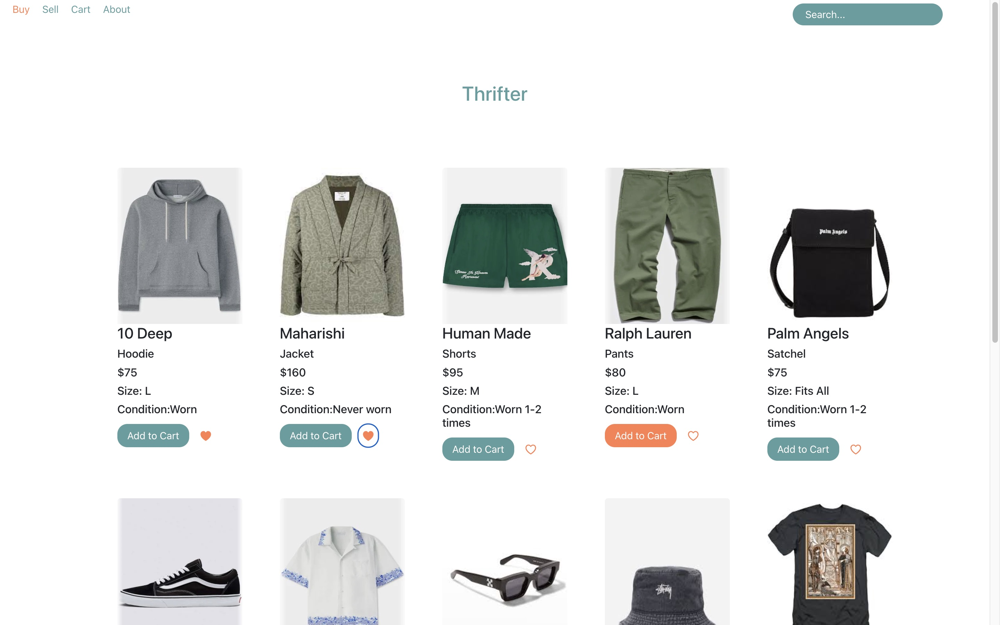

# Welcome To Thrifter

[View live site](https://thrifter-app.onrender.com/)

[View demo](https://www.loom.com/share/1929a9b14b9e45e2ae4466d23d98a256?sid=1bc5230b-3fe9-4612-ab87-5091b54d9ed6)

## Description

 Not just your regular e-commerce clothing site, Thrifter is a contemporary online thrift shop, bringing together high-fashion garments with sustainability. Users are able to both buy and sell quality pieces (and soon donate as well), through a sustainable platform that houses a curated selection of used clothing. Built using React, and Python with Flask, Thrifter is a Full-Stack Web Application built to be a one-stop shop for fashionistas on a budget and swaggy environmentalists.

## Run Locally

1. To get started fork and clone this repository to your local machine. 
2. From your terminal navigate into the project root directory and run the following command: 'gunicorn --chdir server app:app'  
3. Now head to 'http://127.0.0.1:8000' in your browser to view the app. 
